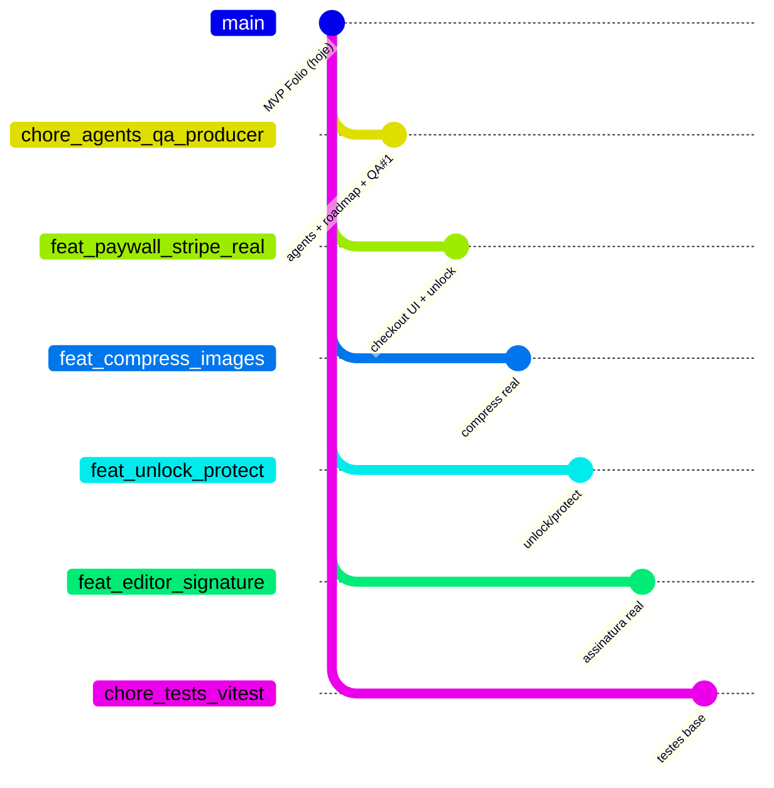

# Folio (pdf-studio) — Roadmap, branches & ideias

> Documento vivo. Atualizar a cada fatia de trabalho (Producer + Dev).  
> Agents locais (não vão no git): `.cursor/agents/producer.md` · `.cursor/agents/qa.md`

**Marca:** Folio · **Modelo:** €0.99 por arquivo (demo hoje) · **Stack:** Next.js 16 + pdf-lib + PDF.js

---

## 1. Mapa didático do produto (ler primeiro)

```
┌─────────────────────────────────────────────────────────────────────────┐
│                         FOLIO — o que o usuário vê                       │
│                                                                         │
│   [ Home ] ──► Editor · Merge · Split · Compress · Pricing              │
│                                                                         │
│   Arquivo PDF no browser ──► processa (sem upload de servidor p/ MVP)  │
│                           ──► demo pay ──► download                     │
└─────────────────────────────────────────────────────────────────────────┘

        AGORA (MVP)                    DEPOIS (investir)                 LONGO
   ┌──────────────────┐          ┌──────────────────────┐         ┌──────────────┐
   │ ● Merge          │          │ ○ Stripe real        │         │ ○ Contas     │
   │ ● Split          │          │ ○ Compress real      │         │ ○ OCR        │
   │ ● Compress leve  │          │ ○ Unlock / Protect   │         │ ○ Convert    │
   │ ● Editor anotar  │          │ ○ Assinatura real    │         │ ○ Cloud/hist │
   │ ○ Pay = DEMO     │          │ ○ Texto nativo melhor│         │ ○ Forms/redact│
   └──────────────────┘          └──────────────────────┘         └──────────────┘
        ● = existe                  ○ = planejado / ideia
```

### Legenda rápida

| Símbolo | Significado |
|---------|-------------|
| `●` | Já existe no código |
| `◐` | Existe, mas incompleto / frágil |
| `○` | Ainda não existe — idea ou feature futura |
| `▶` | Branch / fatia **em atuação agora** |
| `✓` | Fatia concluída (mergeada / aceita) |

---

## 2. Árvore de branches (forma inicial — vai engrossando)

Ainda **há** remoto `JoaoPauloMartins072/pdf-studio` (código no worktree Cursor). O Desktop é a cópia de trabalho da IDE — **sincronizar antes de commit**. A árvore abaixo é o **plano de atuação** + o que já existe.

```
main  (GitHub — Folio MVP commit inicial)
 │
 ├──▶ chore/agents-qa-producer     ← agents locais + roadmap + QA#1 (docs/scripts commitáveis; agents NÃO)
 │
 ├── feat/paywall-stripe-real      ← ligar UI → /api/checkout + webhook unlock
 │
 ├── feat/compress-images          ← compressão real (downsample imagens)
 │
 ├── feat/unlock-protect           ← remover / colocar senha
 │
 ├── feat/editor-signature         ← desenhar / upload de assinatura
 │
 ├── feat/editor-text-polish       ← edição de texto sem prompt tosco
 │
 ├── feat/editor-unicode-bake      ← fix High: fontes WinAnsi / embed (QA#1)
 │
 ├── feat/tool-convert             ← JPG/PNG ↔ PDF (primeira conversão)
 │
 ├── feat/tool-ocr                 ← OCR (mais tarde / custo)
 │
 ├── feat/auth-accounts            ← login + histórico (opcional freemium)
 │
 └── chore/tests-vitest            ← suite mínima (unit lib/pdf + smoke e2e)
```

### Diagrama (Mermaid) — mesma árvore



### Onde estamos atuando **agora**

| Campo | Valor |
|--------|--------|
| **Foco** | `chore/agents-qa-producer` |
| **Owner** | Dev + Producer + QA |
| **Objetivo** | Agents QA/Producer no projeto (gitignored) · roadmap vivo · 1ª bateria de testes no MVP |
| **Próximo depois disto** | Estabilizar bugs críticos do QA → depois `feat/paywall-stripe-real` **ou** `chore/tests-vitest` (decidir com Producer) |

---

## 3. Features — inventário completo

### 3.1 Já no produto (MVP)

| Feature | Rota / área | Estado | Notas |
|---------|-------------|--------|--------|
| Home / marca Folio | `/` | ● | Marketing + CTAs |
| Pricing copy | `/pricing` | ◐ | Texto €0.99; freemium ads só na copy |
| Merge PDFs | `/tools/merge` | ● | Ordem Up/Down (sem drag real) |
| Split / extract | `/tools/split` | ● | Todas as páginas ou intervalo |
| Compress leve | `/tools/compress` | ◐ | Rebuild + object streams; ganho pequeno |
| Editor anotar | `/editor` | ● | Texto, draw, highlight, imagem, páginas |
| Editar texto nativo | Editor | ◐ | `prompt` + whiteout + Helvetica |
| Assinatura | Editor | ◐ | Stamp SVG “Signature” — não é assinatura real |
| Undo / redo | Editor | ● | |
| Bake + download | Editor / tools | ● | pdf-lib |
| Demo paywall | Modal | ◐ | UI fake; libera download sem cobrar |
| API Checkout Stripe | `POST /api/checkout` | ◐ | Existe; UI **não chama** |
| API Webhook | `POST /api/webhook` | ◐ | Valida + log; **não persiste unlock** |

### 3.2 Features a construir (investimento planejado)

Ordem sugerida de investimento (pode mudar):

```
  [1] Paywall Stripe real     ← monetização (alto impacto)
  [2] Testes base Vitest      ← segurança para crescer
  [3] Compress real           ← promessa do produto
  [4] Unlock / Protect        ← tool clássica ILovePDF-like
  [5] Assinatura real         ← editor competitivo
  [6] Texto nativo polish     ← qualidade editor
  [7] Convert (img↔PDF)       ← novo tool de catálogo
  [8] Auth + histórico        ← retenção
  [9] OCR / forms / redact    ← late / caro
```

| Idea / feature | Branch sugerida | Por quê investir | Risco |
|----------------|-----------------|------------------|--------|
| Stripe real + entitlement | `feat/paywall-stripe-real` | Sem isso o pricing é ficção | Alto ($$, secrets) |
| Suite de testes | `chore/tests-vitest` | Evita regressão em PDF | Médio |
| Compress com imagens | `feat/compress-images` | “Compress” hoje quase não comprime | Médio |
| Unlock PDF | `feat/unlock-protect` | Demanda comum; `ignoreEncryption` não é produto | Médio |
| Protect / senha | (mesma branch) | Par simétrico do unlock | Médio |
| Assinatura desenho/upload | `feat/editor-signature` | Stamp atual é placeholder | Baixo |
| Edição de texto decente | `feat/editor-text-polish` | UX atual frágil | Médio |
| JPG/PNG → PDF / PDF → img | `feat/tool-convert` | Amplia catálogo | Médio |
| Contas + histórico | `feat/auth-accounts` | Retorno / freemium | Alto |
| OCR | `feat/tool-ocr` | Diferencial; custo/API | Alto |
| Watermark / redact / forms | TBD | Nicho B2B depois | — |
| Drag-and-drop reorder merge | polish em `feat/*` merge | UX | Baixo |
| Zip no split multi-página | polish split | UX download | Baixo |

### 3.3 Ideias de produto (backlog solto — não esquecer)

- Freemium com ads (já citado no pricing) vs só pay-per-file  
- Processamento 100% client vs jobs server para arquivos grandes  
- Templates de assinatura / carimbos da empresa  
- Comparar PDFs / diff de páginas  
- Batch: vários arquivos, um checkout  
- i18n (PT/EN) — UI hoje em EN  
- PWA / offline  

---

## 4. Fluxo de trabalho (Producer ↔ Dev ↔ QA)

```
   ┌────────────┐     plano + critérios      ┌─────────┐
   │  PRODUCER  │ ─────────────────────────► │   DEV   │
   │  (Remy)    │ ◄──── evidência / PR ──────│         │
   └─────┬──────┘                            └────┬────┘
         │                                        │
         │  “QA, verifica escopo X”               │ código
         ▼                                        ▼
   ┌────────────┐     Ready / Blocked      ┌─────────────┐
   │     QA     │ ◄─────────────────────── │  app Folio  │
   │            │ ──── bugs + severidade ► │             │
   └────────────┘                          └─────────────┘
```

1. **Producer** — corta escopo, atualiza este arquivo, define acceptance criteria.  
2. **Dev** — implementa na branch da feature.  
3. **QA** — happy path · boundary · negativo · segurança · regressão → `Ready` / `Blocked`.  
4. **Producer** — triagem → merge só com evidência.

---

## 5. Diário da árvore (preencher conforme avançamos)

| Data | Branch / fatia | O que entrou | Status | Próximo |
|------|----------------|--------------|--------|---------|
| 2026-08-04 | `chore/agents-qa-producer` | Agents QA+Producer; este roadmap; QA#1 | ✓ | Ver diário |
| 2026-08-04 | QA#1 | Relatório `docs/QA-REPORT-001.md` + smoke `scripts/qa-smoke-pdf.mts` | ✓ | **Ready with minor follow-ups** |
| 2026-08-04 | refactor (Desktop) | App pages padrão Next; libs PDF partilhadas; `useFolioPdfWorkspace`; nomes claros components | ▶ sync → git | Fix High Unicode bake · sync worktree → commit |
| 2026-08-04 | audit IDE | Revalidar agents UTF-8; confirmar gitignore; alinhar Desktop ↔ worktree | ▶ agora | Re-run smoke + decidir próximo feat |

### Veredicto QA#1 (atalho)

```
  build ●  tsc ●  smoke PDF ●  lint ◐ (54 erros src + worker)
  Unicode bake  ██ HIGH — download quebra com CJK / non-WinAnsi
  ESLint editor ██ MED
  Split multi-download ██ MED
  Pricing ≠ Stripe real ██ MED (gap de produto + copy)
```

**Onde vamos atuar a seguir (proposta Producer):**  
1) Sync Desktop → repo git (`main` / branch chore) · 2) Fix High Unicode bake · 3) lint ignore worker · 4) decidir `feat/paywall-stripe-real` vs `chore/tests-vitest`.

*(Novas linhas em cima ou abaixo — manter cronológico.)*

---

## 6. Critérios de teste Folio (resumo para QA)

Sempre que uma fatia tocar PDF ou dinheiro:

1. **Happy path** — arquivo válido → resultado baixável  
2. **Boundary** — 0/1/N páginas; ranges; arquivos grandes  
3. **Negativo** — não-PDF, corrompido, senha  
4. **Paywall** — demo vs Stripe real; webhook idempotente  
5. **Privacidade** — PDF não vaza para endpoint errado; secrets fora do client  
6. **Regressão** — tool vizinha + download  

Detalhe completo: `.cursor/agents/qa.md`.

---

## 7. Como atualizar este arquivo (regra simples)

Toda sessão que **mudar direção** do projeto deve:

1. Marcar `▶` / `✓` na árvore (secção 2)  
2. Mover feature ●/◐/○ na tabela (secção 3)  
3. Acrescentar linha no diário (secção 5)  
4. Dizer em 1 frase: **onde vamos atuar a seguir**

Manter didático. Preferir diagramas ASCII + Mermaid a prosa longa.
